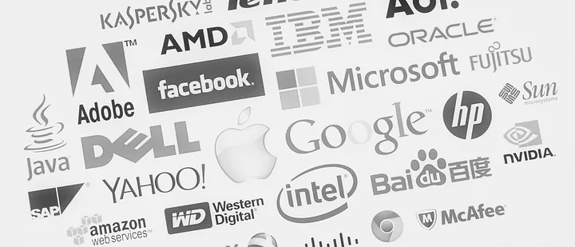

+++
title = 'Get a Marketing Job at a Tech Company - Part 1'
date = 2023-09-18T10:53:10-07:00
draft = false
description='Gain a deeper understanding of the marketing landscape and discover how to navigate your career in tech marketing. I explore the nuances of marketing in the tech industry, delineating the distinct approaches required for consumer, enterprise, and small & medium business segments.'
+++

As a Growth & Marketing person, who has worked at Facebook, LinkedIn and startups like Fivestars (YC W11) I'm often asked how to get into marketing. It is both an easy and hard question to answer because marketing means different things to different people, and it differs by company.  

In this first post I want to highlight some of the differences by company types: **Consumer, Enterprise, SMB** to help you think through potential options. This is relevant because it defines how and who you market to. In a subsequent post, I’ll go over different roles and some questions to help steer you towards a right role for you.

**Consumers:** Adoption and usage are king. Monetization strategies can be far in the future, so efforts are instead spent attracting consumers and getting them to register and adopt the product. The best way to do this is through the product itself and telling a great story around that product. Your product IS your marketing, and your ability to understand customer data gives you the necessary insights to understand what is and isn’t working (from both a product and marketing point of view). And there’s no sales team to work with.

*— Your target market = Anyone with access to the internet. _286M potential users in the US alone_*

**Enterprise:** Customer acquisition is driven by direct sales, and an enterprise marketer works closely with a sales team. New revenue and “logos” are king. More so than with consumers, a product aimed at enterprise has to fulfill a specific need and companies rely heavily on their sales team to convince a group of people that you are the right “solution”. Marketing’s role is to generate awareness of not only the company and the solution, but also the need for the solution (this could be product + services). Marketers assist the sales team in executing on contracts. No sales team = no money. In early stage enterprise companies, the founders are typically the first salespeople.

*— Your target market = Fortune 5000 companies in the US and similarly sizes companies across the world.*

**Small & Medium Businesses:** are, in my opinion, a hybrid of the other two categories. SMBs are price sensitive, since they don’t have the same budgets as enterprise clients. There are literally millions of SMBs, representing a diverse blend of industries (a small accounting firm, a plumbing company, a coffee shop). The Small Business Administration says the US has 20M SMBs — but the vast majority of those have zero employees so the real number is closer to 5 or 6M. Unlike enterprise, where entire teams need to be courted, in SMBs there is usually only one decision maker — so you are trying to convince that one person to buy your product. Of course, your product has to be good, but the biggest challenge is getting that product in front of the decision maker, and then convincing the decision maker that the product is worth it. Even more so than with enterprise customers, to SMBs, every dollar spent is a dollar out of their profit.

*— Your target market = 27M businesses in the US (According to SBA) _though the large majority of those don’t have any employees_.*

Once you can differentiate these three core types, it’s easier to figure out where you might be comfortable as marketers. Fundamentally, we have to understand who we are talking to.

**Consumers:** Me, you, your college friends, that guy sitting over there in the coffee shop…you could be a user of the product! Your intuition can be a good start to understand how a consumer perceives your product and the value they get from it. It can be satisfying to work for a product you and your friends know and use.

**Enterprise:** Enterprise customers often have custom requirements not easily addressed by general purpose products, and enterprise marketing must follow suit. Each company has its own processes and its distinctive fiefs, and it is critical that an enterprise marketer understand not only how large organizations work but also how to position the product best to overcome any internal and external/competitive challenge. It’s a complex sales & marketing process where you address multiple layers and personas in an organization: Executive sponsor, departmental buyer, end-users, as well as ancillary stakeholders (IT probably cares about what software sales, engineering or marketing put on their infrastructure). Being a successful marketer in this space means doing a lot of qualitative research and being close to the sales process to understand both the “political” and “procedural” side of it.

**Small & Medium Businesses:** This is a diverse group, but you encounter SMBs every day. SMBs can be a corner cupcake shop, a retail store at the mall, or a medium Chinese electronics importer. The decision maker at an SMB may be a person with little or no formal education or it could be an ex-McKinsey consultant or Wall Street bankers who has decided to eschew corporate life. Language barriers can be an issue, since it is not uncommon for SMBs to be owned and run by first-gen immigrants. More so than with consumer or enterprise customers, SMB marketers need to build empathy and market products using simple, clear ideas to a myriad of customers.

For an example of how marketers talk to each of these three segments, take a look at how accounting software companies position themselves to consumers, enterprises and SMBs respectively

**Consumer (Turbotax)**:

> ### Get your biggest refund with no appointment or tax knowledge needed

**Enterprise (Netsuite):**

> ### Close quickly with confidence and report financials faster and accurately

**SMB (Quickbooks):**

> ### Simple accounting software. Shockingly easy to use.

See how the value propositions vary by segment? It’s easy to understand why Turbotax promises bigger refunds to consumers. But, without understanding your target market segment, it can be less intuitive that, although the primary concern for accounting departments at enterprise customers is to have “confidence” in their reporting and to be able to “close the books” on time every month, SMBs care far less about a product’s inherent accuracy than its ease of use. Small business owners often don’t have the time to learn a complicated process, and product misuse therefore becomes a real risk — creating the potential for inaccuracies through user error.

I hope this first post provides you with a helpful dimension to begin evaluating marketing opportunities.

[In the next post](https://medium.com/@hlth/so-you-want-to-do-marketing-for-a-tech-company-part-2-6752598c0fb2), I will shed some light on the different roles within marketing. I highly recommend going over [this presentation by Hubspot](https://www.slideshare.net/HubSpot/the-cmos-guide-to-marketing-org-structure) to get an overview of different marketing teams and the roles within them. Though not an exhaustive list, these are real examples.
