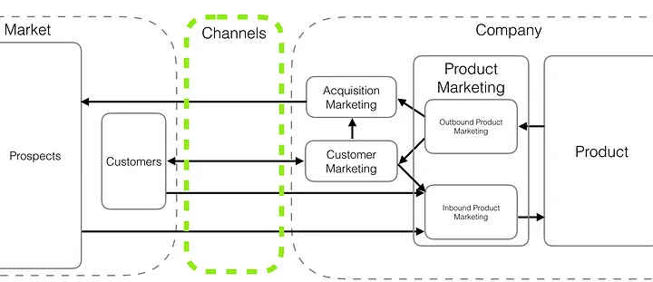
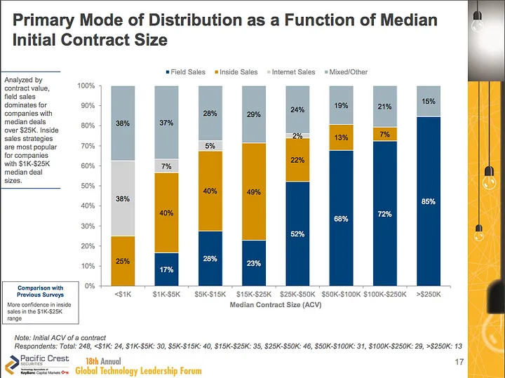

+++
title = 'Get a Marketing Job at a Tech Company - Part 2'
date = 2023-09-18T11:53:10-07:00
draft = false
description='From product marketing to corporate communications, understand the nuances of each role and find your perfect fit in the dynamic world of tech marketing. In this second post, I delve deeper into the various roles within the tech marketing sector. From product marketing to corporate communications, understand the nuances of each role and find your perfect fit in the dynamic world of tech marketing.'
+++

Now that we’ve [talked about the various types of customers]() and how it will influence your marketing, let’s talk about your role. What kind of marketer are you?

If you do a search for **[Marketing at Meta](https://www.linkedin.com/jobs/search/?keywords=marketing%20meta)**, you’ll be greeted by a dizzying array of choices (147 to be precise on an average Sunday evening):

*Growth Marketing Analyst, Internationalization — Director, Product Marketing, Ads Interfaces & Customer Experience — Corporate Communications Director, Ads — Channel Marketing Manager, Regional, SMB — Brand Marketing Manager etc.*

When I first applied for marketing roles at internet companies, I simply had no idea what these titles actually meant. And then I joined Facebook and everything began to make sense. If you are feeling a bit overwhelmed, turns out you’re not alone.

All these roles ultimately revolve around the customer, but from a different viewpoint.

**Product Marketing:** What do our customers want/need, how do we get our product team to build that and how do we best tell them what products we have?

**Acquisition Marketing:** Where can I find our customers, and how do I get them to try our product (and engage with it more)?

**Marketing Communications:** What information and materials do prospect and customers need to purchase our product and remain informed about our products

**Customer Marketing:** How do I help our customers get the most value out of our product?

**Brand Marketing:** What do we want our customers to think and feel about our company?

**Corporate Communications:** What do we want the market to know and think about our company?

### Product Marketing

Product marketers are the glue between marketing and product. Their work involves two directions

* Inbound: They talk to the customers, research the market and work with the product teams to understand use cases and prioritize features based on their potential impact (“our largest customer wants this”, “research shows this is what our users really want”, “people need to click 4 buttons to perform this action”).
* Outbound: Once a product is getting ready to launch, a product marketer readies all the launch material and works with others in marketing, support, operations to ensure a smooth launch (new/updated support article, launch-email to customers, early customer case studies etc.). This work is very important: it guarantees a consistent messaging across all of the potential touch points with a customer.

These individuals have excellent cross-functional (XFN) skills. They have to talk to so many people and project manage complex product launches. If you are an excellent project manager and love bringing a product to market, this is the role for you.

### Acquisition Marketing

Acquisition marketers is where the company meets the market. You have a problem, I have the solution — Buy now! You will create ads, short videos, short headlines and CTAs for adwords, punchy subject lines for your emails, and figure out how to find these people.

* **Acquisition Marketing:** Consumer startups rely on scaled channels like email, organic/SEO, paid (social, ppc etc.). It is often a quantitative team and the goals require finding repeatable and profitable ways of acquiring customers. You’ll find performance marketing, email marketing, SEO roles in those buckets. Budgets are managed to a CPA targets (Cost per acquisition) that are measured daily, weekly and for longer conversion cycles sometimes monthly. Improvements and optimizations can compound over a year, so the cadence of testing, measuring, iterating is really important.
* **Demand Generation:** Same function, different name — it’s usually used in the B2B space. Running events (private dinners, conferences), attending trade shows (like Dreamforce or Marketing Nation) and hosting webinars are much more prevalent as you talk to “high value prospects” (CMOs, CEOs etc. with purchasing power). These teams don’t manage to a CPA, but something a bit higher up the funnel called MQLs and “marketing-influenced pipeline”. This is how they attribute marketing activity to a deal (opportunity created all the way to “Closed Won”). The Marketing operations function helps connect the dots between marketing and sales (managing a system like Marketo or Hubspot that syncs with Salesforce).

The chart below sourced from the Pacific Crest SaaS Survey, shows how your sales motion changes as your product cost increases. To reiterate a point [made in the previous post](), if you work for a company that sells a $50k product, you will succeed only if you partner well with sales. At the lower end, the company’s growth will more directly depend on your work, and typically allows customers to self serve.

### Marketing Communications

Marketing communication roles tend to focus on producing materials highlighting your company’s products, customer successes, best practices etc. They can work across the lifecycle from pre-post acquisition supporting the acquisition and customer marketing team with content.

These people have strong communication and writing skills, project management skills and I find them to often have extrovert personalities (they like talking to customers, organizing events and being in marketing material).

### Customer Marketing

Someone bought your product. Now it’s time to help them adopt it.

Customer marketers all focus on making the user welcome, educating them on the product, driving adoption of key features and emailing them with regular product updates or best practices. All in all, they want to make sure the user gets the most value out of the product.

The holy grail of customer marketing is advocacy. Some people like to call it the second funnel and it consists of evolving your users into advocates.

There’s some strong contrast here between B2B and B2C. In the enterprise world, there are countless teams who will interact with customers one-on-one: customer success, support, technical training. In the consumer world, you simply cannot afford to offer the same level of service.

In the day-to-day, this means that in the B2B world, you need to coordinate messaging across all those teams. In the B2C world, you tend to be more autonomous and can simplify your messaging process.

### Brand Marketing

There’s an adage ***“Nobody ever got fired for buying IBM”***. This is the power of a brand. It stands for something. It could be performance, innovation, reliability or like IBM, the fact that it’s the market leader and the #1 choice.

As a brand marketer, you have to decide what makes your company different. If your competitor calls themselves the market leader (and they are), how do you differentiate yourself? More fundamentally, what does your company want to be known for, and how do you express that (Intel Inside!)?

The job is hard because branding is a game of consistency and repetition over long periods of time. Adding to that complexity, measurements are somewhat indirect. You have to survey individuals using third party services for brand awareness, and track metrics such as share of voice and share of wallet through 3rd party data providers usually.

So from one side, you look outward and monitor the market and where you stand in relation to your competitors. From the other side you have to build strong support across all the teams within the company to ensure everyone knows the brand guidelines and respects them.

While I was at Facebook, a big issue was trust. Users didn’t trust Facebook, despite spending hours on the service each day. Memes would go viral about your photos becoming the company’s property, and more recently there was a lot of noise on the topic of editorial bias for trending news. Thus it became an objective to make Facebook (and the brand Facebook) more trustworthy. The (at the time) newly hired CMO, Gary Briggs, took this as a priority and embarked on a multi-year journey to 1. drive awareness inside the company of this issue 2. establish a framework for measuring trust 3. work with product and marketing to create experiences (product and campaigns) that reinforce trust. The privacy dinosaur was one of those earlier efforts.

People who work in brand marketing span the spectrum from creative to quantitative. The creative side helps you determine the attributes, articulate your visual identity and bridge the gap between function and emotion. The quantitative side will be at ease developing a branding framework, collecting measurements and evangelizing progress inside the company.

### Corporate Communications:

Corporate Communications is in charge of aligning all internal and external messaging to tell the same story. These people make sure that employees, investors, and the general public all have a favorable view of the organization by communicating the same message about its values, vision, direction, and decisions. Not only does this team work closely with Product Marketing and Brand Marketing to ensure that communication is consistent, it also encompasses all employees, from the product manager doing an interview about a new product t0 an engineer presenting at the Grace Hopper conference.

At Facebook, that team was entirely separate from Marketing (be it Platform, Ads or Consumer) and handled PR.

### The special case of “Growth”

Growth as a discipline is the acknowledgment that your best marketing channel is your product. “Marketing” comes second.

Growth focuses on driving product metrics that are beneficial to the company and through either primary or derivative effects will drive additional growth. Here’s a concrete example to highlight the differences:

> #### A company selling a small business marketing product finds that customers who use its email feature churn at a lower rate.
>
> #### Objective: Get more customers to send an email

Growth:

1. Simplify access to the email feature by making it available from the home screen
1. Generate ready-to-send templates that can be quickly selected, edited and then sent
1. Reduce the number of screens/steps/clicks needed to complete the flow

Customer Marketing:

1. Send an email to people who haven’t sent an email recently
1. Do in-app messaging to people who haven’t sent an email blast recently
1. Create a step by step video tutorial showing people how to send an email

### Wrap up

We’ve now reached the end of part 2. [In part 3](), I will share some of my beliefs about working in marketing for startups and more established companies (I’ve done angel/seed, series A, series B, series C and pre-ipo/public). I think it’s important to know what you’re getting into and understand the tradeoffs.