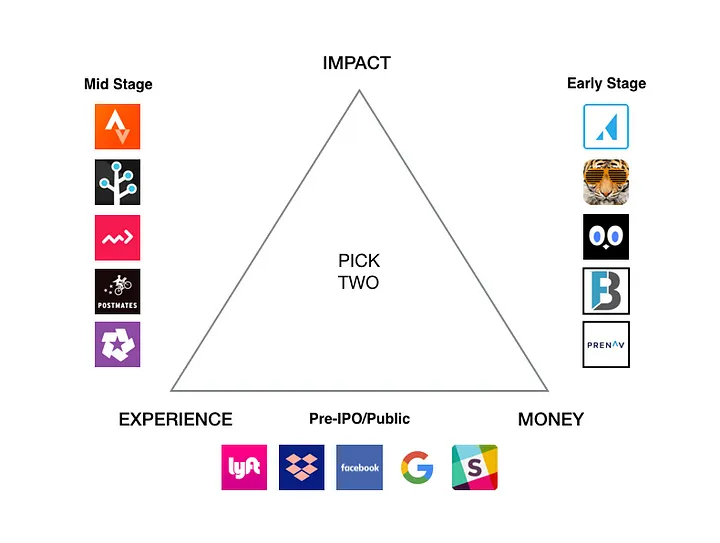

+++
title = 'Get a Marketing Job at a Tech Company - Part 3'
date = 2023-09-18T12:53:10-07:00
draft = false
description='Understand the trade-offs between impact, experience, and money at different stages of a company&rsquo;s growth, and find your sweet spot in the dynamic tech marketing landscape. In the final installment of this series, I guide you in choosing the right startup stage to kickstart your career in tech marketing.'
+++

In [part 1]() and [part 2]() we explored the different types of startups (consumer, enterprise, SMB etc.) and the various marketing roles. In part 3, we delve deeper into understanding the stages of a company and how your experience can vary significantly depending on the stage of the company you choose to work at. From early-stage startups to public companies, each stage offers unique opportunities and challenges.

### What kind of startup is right for you?

Startups are generally categorized into four stages based on their financing:

1. **Early stage**: No funding to series A
2. **Mid stage**: Series B and C
3. **Late stage/Pre-IPO**: Usually series D and above
4. **Public**: Combining Public and Pre-IPO here for simplicity

Having worked at various stages from founding to IPO across four different companies, I have developed a simple framework to help you navigate your career choices. This framework revolves around three pillars: Impact, Money, and Experience.

### The Company Stage Tradeoff — 3 Pick 2

#### **Impact**

At this stage, your role significantly influences the company's survival and potential growth. Your daily contributions are vital, and you likely resonate with the company's mission, resulting in a fulfilling role.

#### **Experience**

This pillar focuses on your personal growth, enhancing your skills, knowledge, and building a network of mentors and peers. Working for a recognizable company at this stage can further propel your career.

#### **Money**

This aspect considers the financial rewards you can reap at different stages. While early-stage startups offer potential high rewards, they come with higher risks compared to pre-IPO and publicly traded companies.

### Understanding Different Stages

* **Early Stage Startups**: Ideal for those seeking a significant impact and willing to invest time and energy. Though the financial rewards might be less, the equity grants can be substantial, offering massive leverage as the company grows.
  
* **Mid Stage Startups**: Offers a balance between impact and financial stability. You can enjoy a broad role while being surrounded by mentors and peers who facilitate your growth.
  
* **Pre-IPO and Public Companies**: These companies are recognizable and offer a rich learning environment with developed functions and strong talent. They provide financial stability and liquidity, making them attractive for those prioritizing financial rewards.

### The Special Case of High Growth Startups

Every once in a while, there’s a startup out there that defies gravity. Dropbox, Stripe, Segment, Slack. When you see a company like this, just get in.

> “If you’re offered a seat on a rocket ship, You don’t ask what seat. You just get on.” — Sheryl Sandberg

For more inspiration, you can explore the [breakout list](https://www.breakoutlist.com/) to find interesting companies.

This concludes the three-part series. Feel free to share your thoughts or connect with me on Twitter [@hlth](https://twitter.com/hlth) or [LinkedIn](https://www.linkedin.com/in/hugoangelmar/).